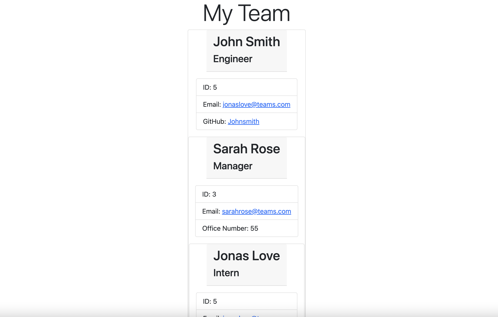

# team-profile-machine
# NewREADME-Generator


## User Story
AS A manager
I WANT to generate a webpage that displays my team's basic info
SO THAT I have quick access to their emails and GitHub profiles


## Acceptance Criteria
GIVEN a command-line application that accepts user input
WHEN I am prompted for my team members and their information
THEN an HTML file is generated that displays a nicely formatted team roster based on user input
WHEN I click on an email address in the HTML
THEN my default email program opens and populates the TO field of the email with the address
WHEN I click on the GitHub username
THEN that GitHub profile opens in a new tab
WHEN I start the application
THEN I am prompted to enter the team manager’s name, employee ID, email address, and office number
WHEN I enter the team manager’s name, employee ID, email address, and office number
THEN I am presented with a menu with the option to add an engineer or an intern or to finish building my team
WHEN I select the engineer option
THEN I am prompted to enter the engineer’s name, ID, email, and GitHub username, and I am taken back to the menu
WHEN I select the intern option
THEN I am prompted to enter the intern’s name, ID, email, and school, and I am taken back to the menu
WHEN I decide to finish building my team
THEN I exit the application, and the HTML is generated


## Description
This project's intention was to generate a webpage displaying an entire teams basic info. The manager would quickly be able to make a webpage based off the user input and the employees the user would like to add. The user would be able to input the different employee types, and then register a name, ID, and email for each. The engineer type would also display a GitHub Profile, while the Manager would display an office number. The intern would display the current school they attend. Following a user's input and when they are done building their team, a HTML is generated that displays a nicely formatted webpage. I was able to pass the tests and generate a basic HTML webpage to insert into the generateHTML javascript file, however could not figure out why Inquirer wasn't working and it wasn't inputing any prompts or answers. I plan on coming back to this project once I receive some help. 

Here is a link to a video displaying the typical user flow of the application: https://drive.google.com/file/d/1u05Y3BJRO-gc2fgsk69yglLo5RwjNAeq/view?usp=sharing


## Usage

Open your integrated terminal and type the command 'node index.js.' This will begin the command-line application and accept your input. Provide answers to each question and your index.html will be successfully generated.  

    ```md
    
    ```

## Credits

GitHub: https://github.com/fcarroll12/team-profile-machine